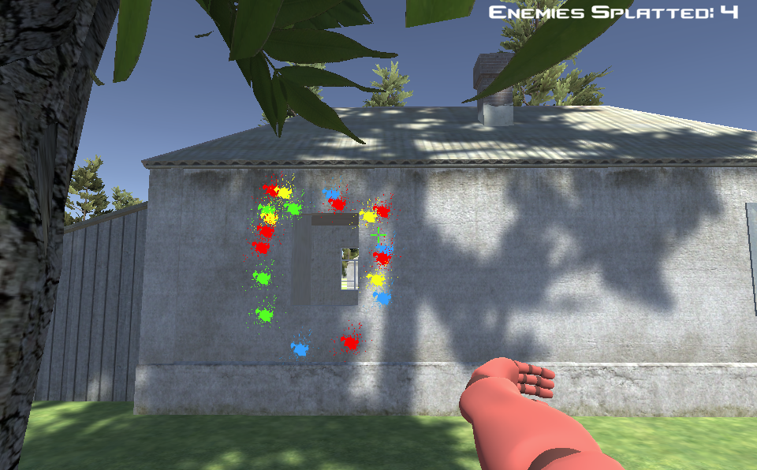

# Paint Splatter Tech Demo

## Play The Game
- https://danbullock.me/PaintSplatterTechDemo/

## About The Game
- A Unity 3D Demo that lets you sprint around and shoot paint at some dummies
- Made to learn FPS mechanics in Unity
- Created by Daniel Bullock @DanBullockCS

## How to Play
- Use WASD to move
- Mouse to look around
- Left Shift to sprint
- Left Alt to sprint faster
- Left Shift + Left Alt to sprint at light speed!
- Left Click / Space to shoot

## ScreenShot of Game

## Tools
- Unity3D
- C# Scripting